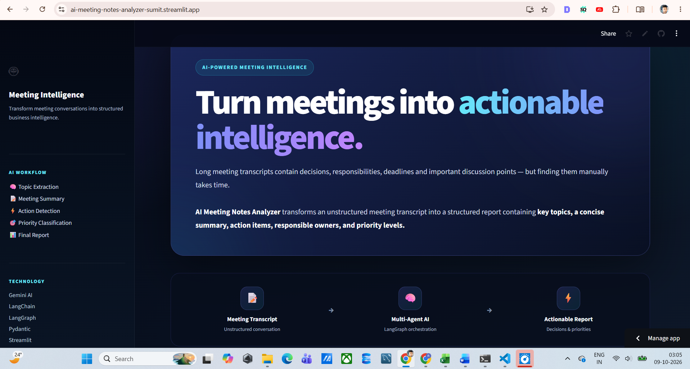
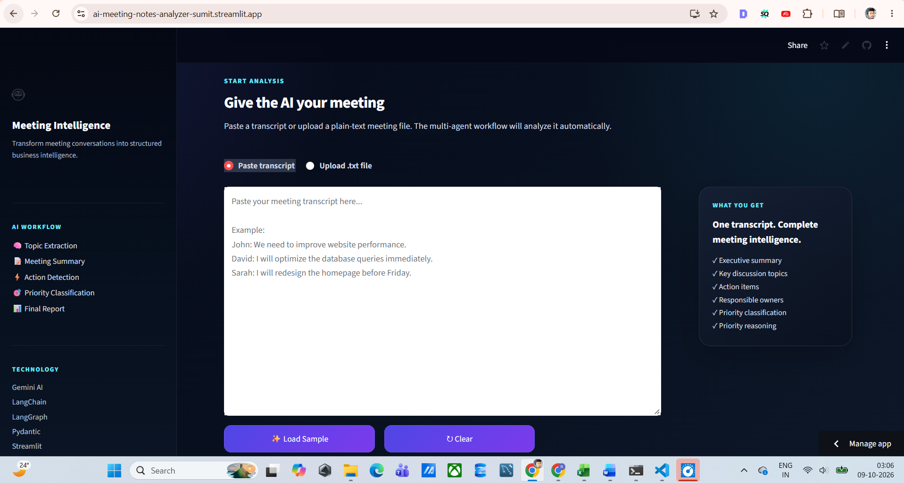
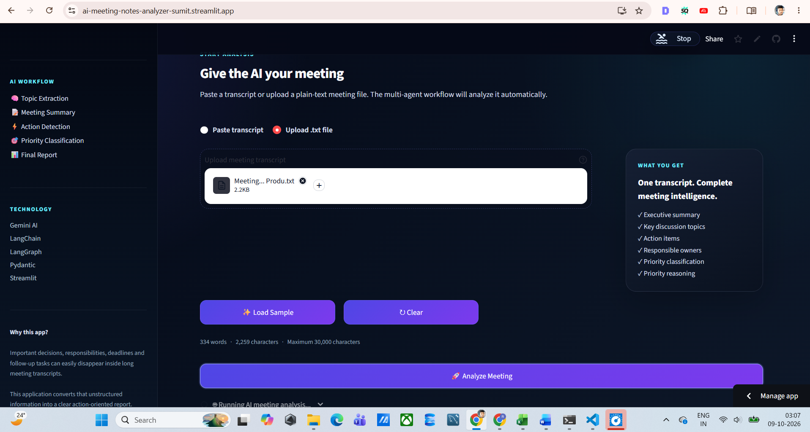
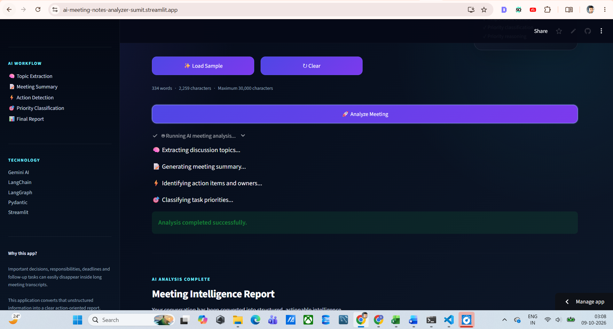
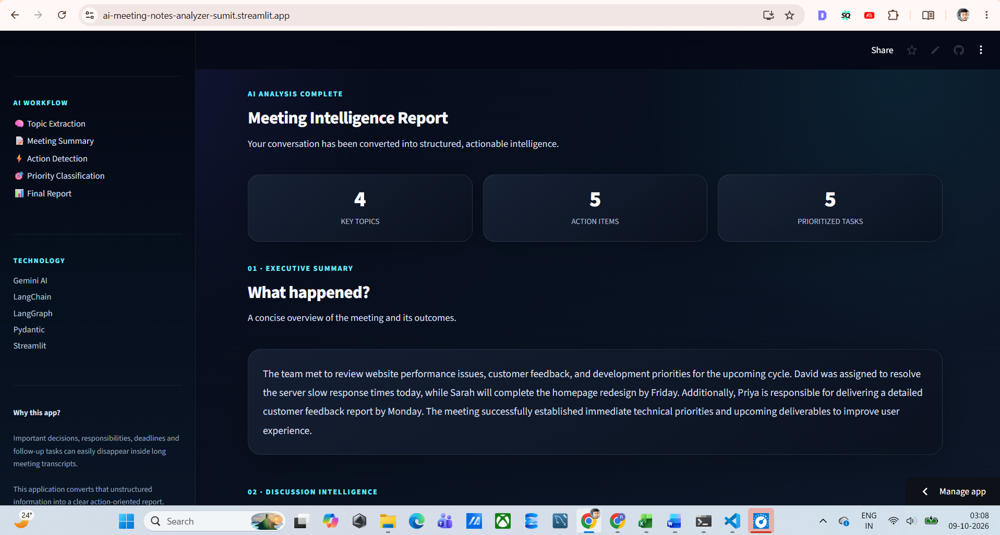
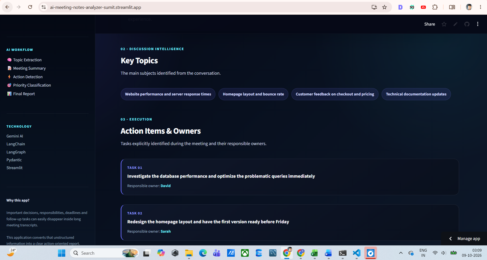
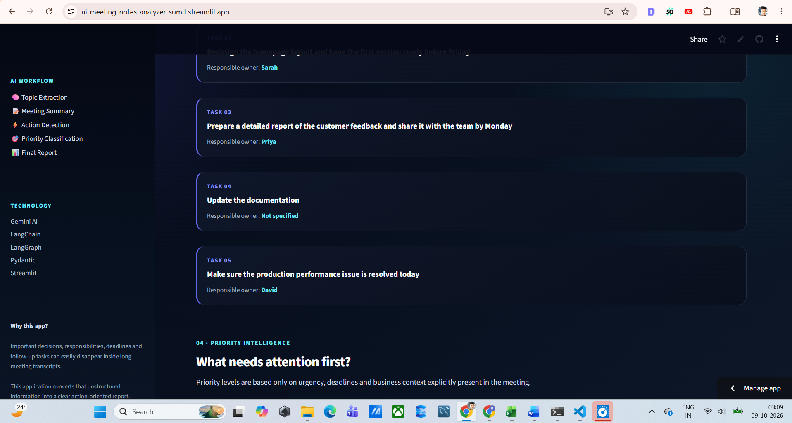
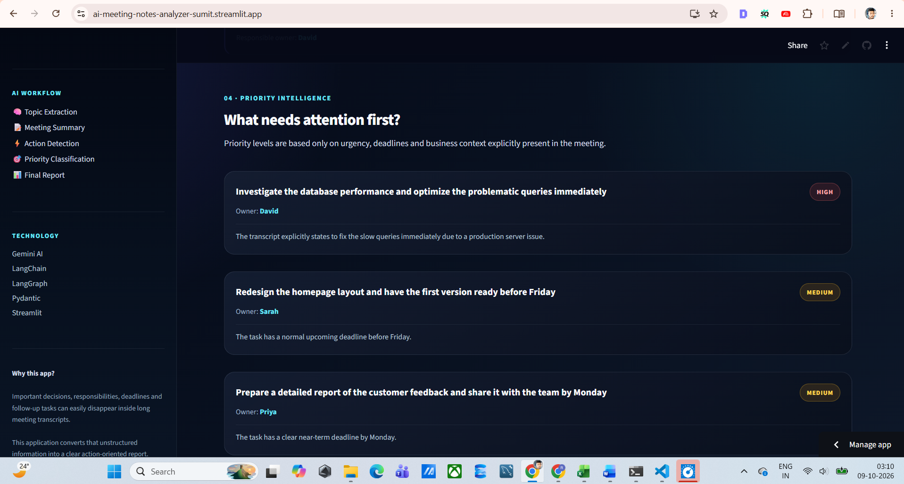
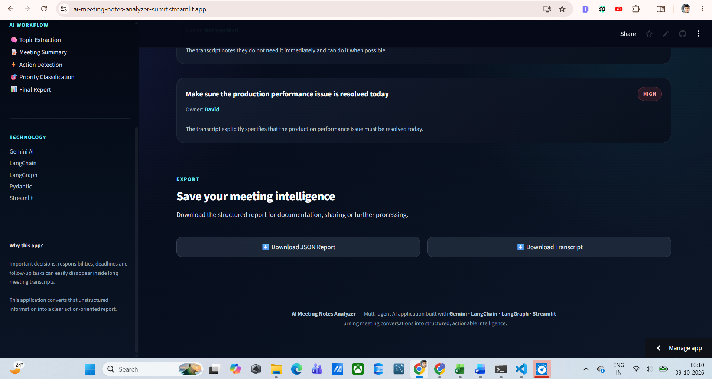

# 🤖 AI Meeting Notes Analyzer

<p align="center">
</p>

<h1 align="center">AI Meeting Notes Analyzer</h1>

<p align="center">
  <strong>Transform unstructured meeting conversations into structured, actionable business intelligence.</strong>
</p>

<p align="center">
  <a href="https://ai-meeting-notes-analyzer-sumit.streamlit.app/">
    
  </a>
  <a href="https://github.com/Sumitghodke16/AI-meeting-notes-analyzer">
    
  </a>
</p>

<p align="center">
  
  
  
  
  
  
  
</p>

---

## 🌐 Live Web Application

<p align="center">
  <a href="https://ai-meeting-notes-analyzer-sumit.streamlit.app/">
    <strong>🚀 Open AI Meeting Notes Analyzer</strong>
  </a>
</p>

## 🌐 Live Application

### 🚀 Try the AI Meeting Notes Analyzer

The application is deployed and available online through Streamlit.

👉 **[Open Live Web App](https://ai-meeting-notes-analyzer-sumit.streamlit.app/)**

The web application allows users to paste a meeting transcript or upload a `.txt` file and automatically transform the conversation into a structured meeting intelligence report.

---

# 📌 Project Overview

Meetings often contain important decisions, responsibilities, deadlines, follow-up tasks, and discussion points that can easily get lost inside long conversations.

The **AI Meeting Notes Analyzer** solves this problem by using a **multi-agent AI workflow** to automatically analyze meeting transcripts and convert them into structured, actionable information.

Instead of manually reading an entire transcript, users can submit a meeting conversation and receive:

- 📝 Executive meeting summary
- 🧠 Key discussion topics
- ⚡ Action items
- 👤 Responsible task owners
- 🎯 Task priority classification
- 💡 Priority reasoning
- 📥 Downloadable structured JSON report
- 📄 Downloadable meeting transcript

The application is designed as a practical example of how **agent-based AI systems can be orchestrated using LangGraph**.

---

# 🎯 Problem Statement

Important information is frequently buried inside meeting conversations.

A typical meeting transcript may contain:

- Important decisions
- Multiple responsibilities
- Deadlines
- Urgent production issues
- Future improvements
- Follow-up discussions
- Tasks without clearly assigned owners

Manually extracting this information is time-consuming and error-prone.

The goal of this project is to automate this process using a structured **multi-agent AI pipeline**.

---

# 💡 Solution

The application processes a meeting transcript through multiple specialized AI agents.

Each agent performs a specific analytical task rather than asking one large model prompt to perform everything at once.


# 🖥️ Application Screenshots

## 01. AI Meeting Intelligence Dashboard

The landing page introduces the AI Meeting Notes Analyzer and explains how the multi-agent workflow transforms meeting conversations into actionable intelligence.

<p align="center">
  
</p>

---

## 02. Meeting Transcript Input

Users can paste their meeting transcript directly into the application before starting the analysis.

<p align="center">
  
</p>

---

## 03. Upload Meeting Transcript

Users can also upload a `.txt` meeting transcript for automated analysis.

<p align="center">
  
</p>

---

## 04. Multi-Agent AI Analysis

After the user starts the analysis, the application displays the AI workflow as it processes the meeting.

The workflow performs:

- 🧠 Topic extraction
- 📝 Meeting summarization
- ⚡ Action-item detection
- 🎯 Priority classification

<p align="center">
  
</p>

---

## 05. Executive Meeting Summary

The Summary Agent converts the meeting conversation into a concise executive-level summary containing the key outcomes, responsibilities, and deadlines.

<p align="center">
  
</p>

---

## 06. Key Discussion Topics

The Topic Extraction Agent identifies the major subjects discussed during the meeting and presents them as structured topic tags.

<p align="center">
  
</p>

---

## 07. Action Items & Responsible Owners

The Action Agent identifies tasks that need to be completed and extracts explicitly assigned responsible owners.

If responsibility is not explicitly assigned, the system displays:

`Not specified`

<p align="center">
  
</p>

---

## 08. Priority Intelligence

The Priority Classification Agent evaluates action items using urgency, deadlines, and business context from the original meeting transcript.

Each task is classified as:

- 🔴 **High**
- 🟡 **Medium**
- 🟢 **Low**

The application also provides a short explanation for each priority decision.

<p align="center">
  
</p>

---

## 09. Export Meeting Intelligence

After analysis, users can download the generated meeting intelligence as a structured JSON report and download the original meeting transcript.

<p align="center">
  
</p>

# 🔄 AI Meeting Notes Analyzer — Workflow

The application follows a **multi-agent AI workflow** in which the meeting transcript is passed through specialized agents and then combined into a structured meeting intelligence report.

```mermaid
flowchart TD

    A["📝 Meeting Transcript<br/>Paste text or upload .txt file"]

    B["🖥️ Streamlit Web App<br/>User Interface"]

    C["🔀 LangGraph Workflow<br/>Multi-Agent Orchestration"]

    D["🧠 Topic Extraction Agent<br/>Identify key discussion topics"]

    E["📄 Summary Agent<br/>Generate concise meeting summary"]

    F["⚡ Action Item Agent<br/>Extract tasks and responsible owners"]

    G{"🎯 Action Items<br/>Detected?"}

    H["🔴 Priority Classification Agent<br/>Classify High / Medium / Low"]

    I["⏭️ Skip Priority Classification<br/>No action items identified"]

    J["📊 Final Report<br/>Combine all AI outputs"]

    K["📋 Executive Summary"]

    L["🧠 Key Discussion Topics"]

    M["⚡ Action Items & Owners"]

    N["🎯 Priority Levels & Reasoning"]

    O["📥 Export Results<br/>JSON Report + Transcript"]


    A --> B
    B --> C

    C --> D
    D --> E
    E --> F
    F --> G

    G -->|Yes| H
    G -->|No| I

    H --> J
    I --> J

    J --> K
    J --> L
    J --> M
    J --> N

    K --> O
    L --> O
    M --> O
    N --> O


    classDef input fill:#172554,stroke:#38bdf8,color:#f8fafc,stroke-width:2px;
    classDef workflow fill:#312e81,stroke:#818cf8,color:#f8fafc,stroke-width:2px;
    classDef agent fill:#1e1b4b,stroke:#a78bfa,color:#f8fafc,stroke-width:2px;
    classDef decision fill:#3b0764,stroke:#c084fc,color:#f8fafc,stroke-width:2px;
    classDef output fill:#064e3b,stroke:#34d399,color:#f8fafc,stroke-width:2px;

    class A,B input;
    class C workflow;
    class D,E,F,H,I agent;
    class G decision;
    class J,K,L,M,N,O output;
